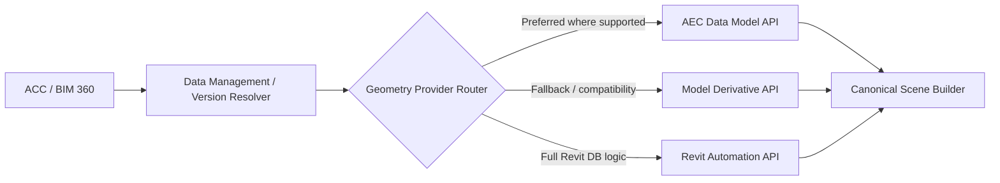
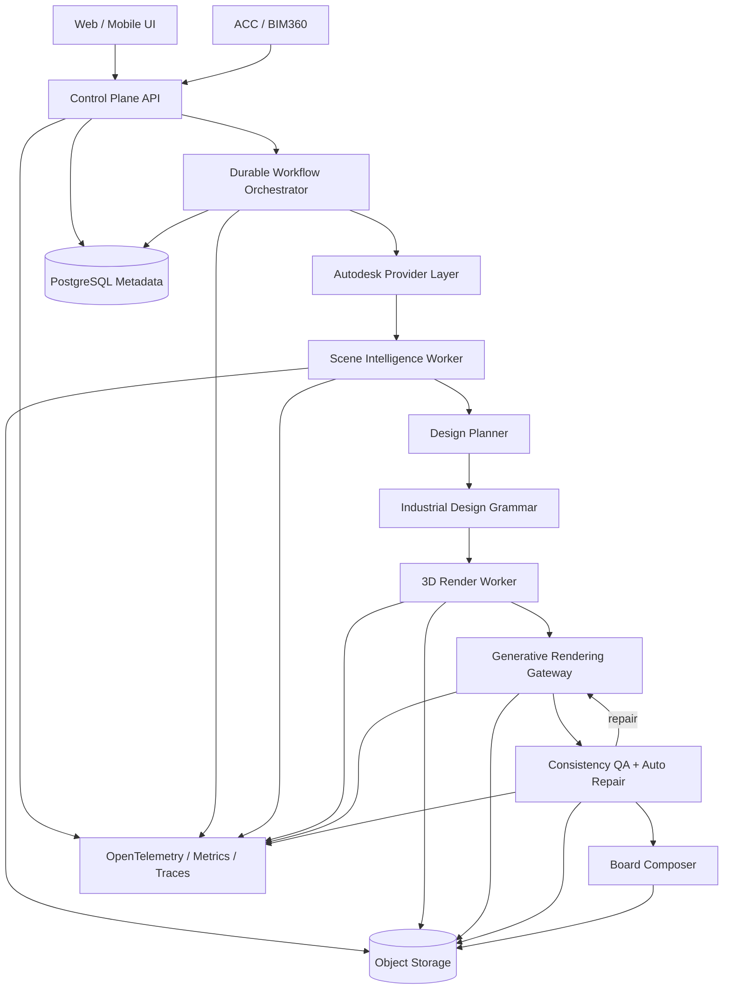
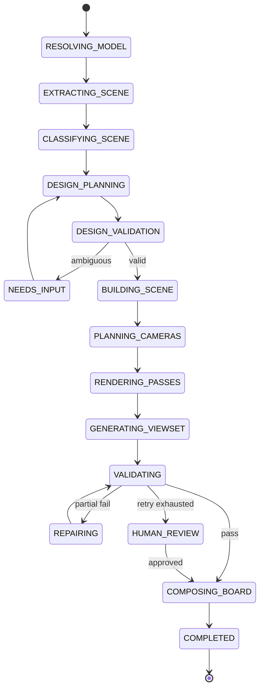

# V365 Revit — Technical Plan, Specifications & Requirements
## Hệ thống sinh diễn họa kiến trúc đa góc nhìn nhất quán từ Revit LOD100 cho nhà xưởng công nghiệp

**Document type:** Production Architecture / Technical Design / Product Requirements  
**Version:** 1.0  
**Date:** 2026-09-08  
**Status:** Proposed baseline architecture  
**Primary use case:** Revit LOD100 / massing model → bộ ảnh diễn họa nhà xưởng công nghiệp chuyên nghiệp, photorealistic, nhiều góc nhìn và nhất quán về hình học + thiết kế.

---

## 0. Executive Summary

### 0.1. Bài toán

Đầu vào hiện tại là mô hình Revit LOD100, phần lớn chỉ gồm các khối/massing đơn giản. Hệ thống cần tự động tạo ra bộ ảnh diễn họa chất lượng marketing/concept tương tự các bộ ảnh kiến trúc công nghiệp gồm:

1. **Overall View** — góc chim bay / tổng thể.
2. **Context View** — góc tiếp cận công trình.
3. **Office View** — góc khối văn phòng / sảnh chính.
4. **Detail View** — góc khu loading dock / cửa cuốn / mặt đứng.

Yêu cầu quan trọng nhất không chỉ là “ảnh đẹp”, mà là:

> Các ảnh phải là các phép chiếu khác nhau của **cùng một thiết kế**, không phải bốn lần AI tự sáng tác lại công trình.

Pipeline hiện tại:

```text
Revit LOD100
    ↓
Đọc các khối + metadata
    ↓
Ảnh góc nhìn LOD100
    ↓
Gemini generate từng view độc lập
```

có một giới hạn nền tảng: image model không có một world-state 3D bắt buộc phải tuân theo. Vì vậy cùng một mặt đứng có thể bị thay đổi số cửa, vị trí cửa, façade, mái, khối văn phòng, cây xanh hoặc loading dock giữa các góc nhìn.

### 0.2. Quyết định kiến trúc

Kiến trúc đề xuất phải đi theo nguyên tắc:

> **Geometry-first, shared-scene, generation-second.**

Pipeline chuẩn:

```text
Autodesk / Revit LOD100
        ↓
Canonical 3D Scene
        ↓
Design DNA + Factory Design Grammar
        ↓
Deterministic Visual Scene Builder
        ↓
Một Shared Designed Scene
        ↓
Nhiều camera + RGB/Depth/Normal/Mask/ID
        ↓
Generative Photorealistic Refinement
        ↓
Cross-view Consistency Validation
        ↓
Automatic Region Repair
        ↓
Final View Set + Concept Board
```

**Không xây MVP kiểu throw-away rồi sau đó thay kiến trúc.** Ngay từ đầu hệ thống được thiết kế theo contract production; các module nâng cao có thể bật dần bằng feature flag nhưng không thay đổi data model, workflow contract hoặc service boundary.

### 0.3. Kết luận kỹ thuật

Kiến trúc sản phẩm nên có ba lớp kiểm soát:

1. **3D geometry = source of truth.**
2. **Design DNA + procedural grammar = source of design truth.**
3. **Generative model = visual intelligence / photorealistic layer.**

Gemini vẫn được sử dụng mạnh, nhưng không được là nơi duy nhất quyết định hình học công trình.

---

# 1. Research Foundation

Kiến trúc này không chỉ dựa trên suy luận hệ thống mà bám trực tiếp vào các hướng nghiên cứu multi-view generation hiện nay.

## 1.1. CAADRIA 2025 — sát nhất với bài toán LOD100

**Paper:** *Multi-View Depth Consistent Image Generation Using Generative AI Models: Application on Architectural Design of University Buildings* — Xusheng Du et al., CAADRIA 2025.

Điểm tương đồng rất lớn với bài toán V365:

- Input là **shoebox model** / massing model đơn giản ở giai đoạn thiết kế sớm.
- Cần sinh architectural images từ nhiều viewpoint.
- Vấn đề chính là **multi-view consistency**.
- Sử dụng ControlNet làm backbone.
- Bổ sung multi-view module và cross-attention.
- Dùng các loss về style, structure và angle alignment.
- Sử dụng depth + depth-aware 3D attention để tăng coherence 3D.

**Bài học áp dụng cho V365:** không xử lý mỗi view như một generation job độc lập; phải tạo view-set có shared geometric conditions.

Nguồn:

- Paper: https://arxiv.org/abs/2503.03068
- CAADRIA DOI: https://doi.org/10.52842/conf.caadria.2025.1.111
- PDF: https://papers.cumincad.org/data/works/att/caadria2025_567.pdf

---

## 1.2. ControlNet — structural conditioning

**Paper:** *Adding Conditional Control to Text-to-Image Diffusion Models*, ICCV 2023.

ControlNet chứng minh có thể đưa các điều kiện không gian như:

- depth,
- edges,
- segmentation,
- normals,
- line drawings

vào diffusion model để buộc kết quả bám cấu trúc input tốt hơn.

**Bài học áp dụng:** RGB screenshot LOD100 là chưa đủ. Render worker cần sinh ra một **conditioning pack** có cấu trúc.

Nguồn:

- Paper: https://arxiv.org/abs/2302.05543
- CVF: https://openaccess.thecvf.com/content/ICCV2023/html/Zhang_Adding_Conditional_Control_to_Text-to-Image_Diffusion_Models_ICCV_2023_paper.html
- Official code: https://github.com/lllyasviel/ControlNet

---

## 1.3. SyncDreamer — joint multi-view generation

**Paper:** *SyncDreamer: Generating Multiview-consistent Images from a Single-view Image*, ICLR 2024 Spotlight.

SyncDreamer không mô hình hóa các ảnh như các output độc lập mà học **joint probability distribution của một tập multi-view images**, đồng bộ latent state giữa các view thông qua 3D-aware feature attention.

**Bài học áp dụng:** interface của hệ thống V365 phải là:

```text
GenerateViewSet(...)
```

thay vì thiết kế core contract là:

```text
GenerateSingleView(...)
```

Ngay cả khi provider hiện tại vẫn xử lý tuần tự, orchestration và data contract phải coi toàn bộ view-set là một generation unit.

Nguồn:

- Paper: https://arxiv.org/abs/2309.03453
- ICLR: https://proceedings.iclr.cc/paper_files/paper/2024/hash/753d9584b57ba01a10482f1ea7734a89-Abstract-Conference.html
- Code: https://github.com/liuyuan-pal/SyncDreamer

---

## 1.4. MVDream — multi-view diffusion as a shared 3D prior

MVDream sinh nhiều view nhất quán từ cùng một prompt và sử dụng multi-view diffusion như một generalizable 3D prior.

**Bài học áp dụng:** multi-view consistency không nên phụ thuộc vào “same prompt” hoặc “same seed”; consistency cần được xử lý ở representation/model level.

Nguồn:

- Paper: https://arxiv.org/abs/2308.16512
- Code/reference implementation: https://github.com/bytedance/MVDream

> Repository MVDream đã được archive; sử dụng như research reference, không lấy nguyên repo làm production core.

---

## 1.5. CAMEO — correspondence-aware attention, CVPR 2026

**Paper:** *Correspondence-Attention Alignment for Multi-View Diffusion Models*, CVPR 2026.

CAMEO chỉ ra rằng multi-view diffusion model học geometric correspondence trong attention, nhưng correspondence giảm chất lượng khi viewpoint thay đổi lớn. CAMEO supervise attention trực tiếp bằng correspondence hình học để giữ geometry tốt hơn và tăng hiệu quả training.

**Bài học áp dụng:** nếu V365 đi đến custom multi-view model, dataset phải lưu:

- camera intrinsics/extrinsics,
- 3D surface identity,
- pixel-to-surface correspondence,
- visible/occluded mapping.

Đây là dữ liệu rất giá trị để train attention alignment thay vì chỉ lưu cặp ảnh.

Nguồn:

- CVF: https://openaccess.thecvf.com/content/CVPR2026/html/Kwon_Correspondence-Attention_Alignment_for_Multi-View_Diffusion_Models_CVPR_2026_paper.html
- Project: https://cvlab-kaist.github.io/CAMEO/

---

## 1.6. MVRoom — geometry/layout phải tồn tại xuyên suốt pipeline

**Paper:** *MVRoom: Controllable 3D Indoor Scene Generation with Multi-View Diffusion Models*, 2025.

MVRoom conditioning trên coarse 3D layout và tiếp tục đưa layout vào multi-view generation thông qua layout-aware epipolar attention.

**Bài học áp dụng:** không nên dùng geometry chỉ ở bước đầu rồi để image model tự do ở phần sau. Coarse layout / geometric priors phải được giữ xuyên suốt.

Nguồn:

- https://arxiv.org/abs/2512.04248

---

## 1.7. AnchoredDream — geometry grounding trước appearance synthesis

**Paper:** *AnchoredDream: Zero-Shot 360° Indoor Scene Generation from a Single View via Geometric Grounding*, 2026.

Hướng tiếp cận gồm geometry grounding, warp/inpaint/refine và post-optimization để chống drift khi camera thay đổi mạnh.

**Bài học áp dụng:** với view gần nhau, có thể reprojection/warp appearance giữa các camera, sau đó chỉ generative-fill vùng mới lộ ra thay vì regenerate toàn bộ ảnh.

Nguồn:

- https://arxiv.org/abs/2601.16532

---

## 1.8. Facades-3D — project thực tế rất đáng tham khảo

**Project:** CTLab-ITMO / Facades-3D.

Repo nhận mass model, prompt/style reference và generate detailed facade meshes. Project kết hợp Stable Diffusion/ControlNet, facade LoRA và TRELLIS; vertex positions của mass model được giữ làm geometric anchor.

Điểm quan trọng không phải lấy nguyên repo vào V365, mà là bằng chứng thực tiễn rằng pipeline:

```text
mass model
→ facade synthesis
→ 3D/detail generation
```

là hướng khả thi.

Repo cũng tự chỉ ra limitation của generation nặng GPU và generic template geometry — đây chính là lý do V365 nên dùng **industrial procedural grammar chuyên biệt** thay vì generic 3D generation hoàn toàn.

Nguồn:

- https://github.com/CTLab-ITMO/Facades-3D

---

## 1.9. Facade ControlNet projects

Một số project public cho thấy semantic segmentation + ControlNet có thể giữ spatial alignment cho façade:

- https://github.com/doguilmak/Facades-ControlNet-SD15
- https://github.com/elifKALENDER/SketchToRender

Các repo này không giải quyết đầy đủ multi-view nhưng rất hữu ích để tham khảo training/fine-tune pipeline cho façade.

---

# 2. Product Scope

## 2.1. In scope

Phiên bản production target hỗ trợ:

- Revit LOD100 / early massing models.
- Nhà xưởng công nghiệp, logistics, manufacturing campus.
- Một hoặc nhiều building mass trong cùng site.
- 4 nhóm camera tiêu chuẩn:
  - overall,
  - context,
  - office/main entrance,
  - loading/detail.
- Style preset và style reference.
- Custom design brief từ người dùng.
- Sinh Design DNA dùng chung.
- Procedural façade/site enrichment.
- Render nhiều view từ một shared scene.
- Photorealistic generative refinement.
- Automated cross-view QA.
- Region-level repair.
- Output ảnh riêng + concept board.
- Lưu provenance/revision để tái tạo phiên bản thiết kế.

## 2.2. Out of scope giai đoạn đầu

Không đặt mục tiêu:

- thay thế Revit LOD300/LOD400;
- tạo construction documents;
- bảo đảm code compliance;
- tự thiết kế kết cấu/MEP;
- sinh chính xác mọi typology kiến trúc;
- cho image model quyền thay đổi footprint hoặc structural mass;
- dùng generated image làm nguồn đo kích thước kỹ thuật.

---

# 3. Architecture Principles

## P-01 — Autodesk remains source of truth

Không duplicate toàn bộ RVT hoặc toàn bộ mesh vào application database.

DB của V365 chỉ lưu:

- Autodesk project/model/version references,
- design revision,
- camera spec,
- Design DNA,
- generation configuration,
- output references,
- QA metrics,
- audit/provenance.

Geometry chỉ tồn tại trong job/cache có TTL, trừ khi người dùng chủ động export.

---

## P-02 — No mandatory GLB/glTF layer

GLB/glTF chỉ là optional export/debug format.

Canonical scene là logical data model của V365, không đồng nghĩa với GLB.

Production path ưu tiên:

```text
APS geometry
→ in-memory canonical scene
→ Blender Python / render worker
```

không bắt buộc:

```text
APS
→ GLB
→ reload GLB
→ Blender
```

---

## P-03 — Provider abstraction for Autodesk extraction

Không hard-code production architecture vào duy nhất một APS API.

Tạo contract:

```text
IGeometryProvider
```

với ba implementations:

1. **AEC Data Model Provider** — ưu tiên granular/cloud-native geometry khi supported.
2. **Model Derivative Provider** — compatibility/fallback.
3. **Revit Automation Provider** — escape hatch cho logic yêu cầu full Revit DB API.

Điều này bảo vệ hệ thống trước khác biệt giữa BIM 360/ACC, Revit version và phạm vi API.

---

## P-04 — Shared scene before multiple views

Mọi view thuộc một `DesignRevision` bắt buộc render từ cùng:

- canonical geometry,
- Design DNA,
- asset bindings,
- material library,
- environment,
- sun/time,
- façade rule set.

Không cho phép một view tự sinh “design state” riêng.

---

## P-05 — Hard constraints vs soft generative content

### Hard constraints

AI không được tự ý thay đổi:

- footprint;
- building position;
- building height;
- main mass;
- roof profile sau khi được quyết định;
- office block location;
- loading dock count/location sau khi Design DNA đã lock;
- primary façade division;
- road/site layout nếu đã có geometry;
- logo/signage position;
- camera pose.

### Soft constraints

AI có thể linh hoạt hơn với:

- cloud;
- people;
- minor vegetation variation;
- reflections;
- weathering;
- atmosphere;
- small non-structural props.

---

## P-06 — Deterministic board composition

AI chỉ sinh ảnh.

Concept board cuối cùng phải được dựng bằng HTML/SVG/Canvas/Skia hoặc image compositor deterministic.

Không yêu cầu image model tự vẽ các label:

```text
01 OVERALL VIEW
02 CONTEXT VIEW
...
```

Điều này bảo đảm typography, brand guideline và text chính xác.

---

## P-07 — Same architecture from first implementation

Các feature nâng cao có thể chưa bật ngay, nhưng interfaces phải có từ ngày đầu:

- `ViewSet` thay vì `SingleView`.
- `ConditioningPack` dù provider đầu tiên chưa dùng hết.
- `ConsistencyReport`.
- `RepairRequest`.
- `DesignRevision`.
- `GeometryProvider`.
- `GenerativeProvider`.

Nhờ vậy R&D multi-view model sau này thay provider mà không viết lại toàn hệ thống.

---

# 4. Autodesk Data Access Architecture

## 4.1. Primary flow



## 4.2. AEC Data Model

Autodesk mô tả AEC Data Model API là API GraphQL cloud-native để truy cập granular design data mà không cần desktop plug-in.

Từ 2025 Autodesk công bố public beta cho granular Revit geometry, bao gồm resolved geometry, transforms và in-memory mesh qua Data Interoperability SDK. DevCon 2026 tiếp tục xác nhận AEC Data Model cung cấp granular Revit geometry/properties/relationships.

Nguồn:

- https://aps.autodesk.com/developer/overview/aec-data-model-api
- https://aps.autodesk.com/blog/access-revit-geometry-aec-data-model-public-beta
- https://aps.autodesk.com/blog/building-agentic-ai-whats-new-autodesk-platform-services

### Quyết định

AEC Data Model là **preferred provider khi project/model/version hỗ trợ đầy đủ**, nhưng không được là single point of architecture dependency vì một số geometry capability/SDK vẫn có thể có phạm vi beta hoặc rollout khác nhau.

---

## 4.3. Model Derivative

Model Derivative có khả năng extract:

- object hierarchy,
- properties,
- geometry,
- viewable derivatives.

Nguồn:

- https://aps.autodesk.com/developer/overview/model-derivative-api

### Quyết định

Sử dụng làm:

- stable compatibility layer,
- viewer integration,
- fallback data extraction,
- BIM360/legacy workflow compatibility.

---

## 4.4. Revit Automation API

Autodesk Automation API cho phép chạy Revit engine trên cloud và access full Revit DB API mà không cần Revit Desktop trên server của V365.

Nguồn:

- https://aps.autodesk.com/developer/overview/automation-api
- https://aps.autodesk.com/automation-apis

### Chỉ sử dụng khi

- cần Revit-specific geometry operation;
- cần family-specific logic;
- provider khác không trả đủ dữ liệu;
- cần modify/create Revit content;
- cần custom Revit add-in logic.

Không dùng Automation cho mọi request vì chi phí/latency/queue sẽ cao hơn granular API.

---

# 5. High-Level Production Architecture



---

# 6. Recommended Deployment Boundaries

Không cần biến mọi module thành một microservice riêng ngay lập tức. Để vừa production-ready vừa tránh service sprawl, deploy theo bốn runtime classes.

## Runtime A — Control Plane

Bao gồm:

- FastAPI/API gateway;
- authentication;
- project/model selection;
- design brief;
- job APIs;
- generation history;
- revision management;
- APS OAuth integration.

## Runtime B — Workflow + Scene CPU Workers

Bao gồm:

- APS extraction adapters;
- canonical scene builder;
- semantic classifier;
- camera planner;
- Design DNA validation;
- job preparation.

## Runtime C — Render / GPU Workers

Bao gồm:

- Blender headless;
- procedural scene builder;
- PBR assets;
- conditioning pass generation;
- optional self-hosted ControlNet/multi-view models.

## Runtime D — QA / Composition Workers

Bao gồm:

- geometric/image QA;
- cross-view validation;
- region mask generation;
- repair orchestration;
- deterministic concept board composition.

Các logical modules vẫn tách rõ trong codebase để sau này có thể split deploy độc lập nếu throughput yêu cầu.

---

# 7. Workflow Orchestration

## 7.1. Recommended: Temporal

Đây là workflow có nhiều bước dài, retry, external API call và partial failure. Nên sử dụng durable workflow engine như **Temporal** thay vì tự nối Celery jobs bằng trạng thái thủ công.

Một generation có thể gồm:

```text
Resolve model version
→ Fetch geometry
→ Build canonical scene
→ Infer semantic roles
→ Create/validate Design DNA
→ Build designed scene
→ Plan cameras
→ Render passes
→ Generate view set
→ QA
→ Repair failed regions
→ Upscale/finalize
→ Compose board
```

Temporal phù hợp vì:

- durable state;
- retry;
- idempotency;
- timeout;
- compensation;
- long-running workflow;
- human-in-the-loop pause/resume.

## 7.2. Idempotency key

```text
project_id
+ model_version_id
+ design_revision_id
+ render_profile_id
+ view_set_version
```

Không tạo job duplicate khi webhook hoặc request bị gửi lại.

---

# 8. Canonical Scene Specification

## 8.1. Canonical Scene không phải file format

Đây là internal contract.

```text
CanonicalScene
├── source
├── coordinate_system
├── elements[]
├── surfaces[]
├── semantic_roles[]
├── site
├── cameras[]
└── constraints[]
```

## 8.2. Element contract

```json
{
  "scene_element_id": "scene:factory-A:mass-01",
  "source": {
    "provider": "aec_data_model",
    "external_id": "revit-unique-id",
    "category": "Mass",
    "model_version_id": "..."
  },
  "transform": {
    "matrix4x4": []
  },
  "mesh_ref": "temporary://mesh/...",
  "bbox": {
    "min": [0, 0, 0],
    "max": [80, 35, 12]
  },
  "semantic_role": "main_shed",
  "constraint_level": "hard"
}
```

## 8.3. Surface contract

Mỗi façade quan trọng phải có local coordinate system:

```json
{
  "surface_id": "factory-A:south",
  "element_id": "scene:factory-A:mass-01",
  "frame": {
    "origin": [0, 0, 0],
    "u_axis": [1, 0, 0],
    "v_axis": [0, 0, 1],
    "normal": [0, -1, 0]
  },
  "width_m": 80.0,
  "height_m": 12.0,
  "semantic_role": "primary_facade"
}
```

### Tại sao local UV/frame rất quan trọng?

Thay vì AI nói:

```text
"đặt 4 loading dock ở bên trái"
```

hệ thống lưu:

```text
dock_01: surface=south, u=0.18
dock_02: surface=south, u=0.28
dock_03: surface=south, u=0.38
dock_04: surface=south, u=0.48
```

Mọi camera sau đó nhìn thấy cùng các dock ở cùng world-space coordinates.

---

# 9. Semantic Role Inference

LOD100 thường không đủ semantics. Hệ thống cần một lớp suy luận nhưng không để LLM quyết định mù.

## 9.1. Inputs

- Revit category;
- element name/parameters;
- geometry dimensions;
- relative position;
- site access;
- adjacency;
- user design brief;
- optional existing labels.

## 9.2. Target roles

```text
main_shed
office_block
loading_zone
service_yard
utility_block
parking
main_entrance
secondary_entrance
landscape_zone
roof
site_boundary
```

## 9.3. Confidence policy

```text
confidence >= 0.90 -> auto accept
0.60–0.90          -> auto accept + UI review indicator
< 0.60             -> require user selection / fallback rule
```

Không để low-confidence semantic inference silently đi vào final generation.

---

# 10. Design Brief Contract

Do LOD100 không thể tự chứa mọi yêu cầu thiết kế, UI phải cho người dùng nhập brief nhanh.

## Required fields

- project type;
- desired style;
- primary/secondary colors;
- façade material preference;
- office emphasis;
- sustainability level;
- roof solar preference;
- landscape level;
- loading dock requirement;
- desired time/weather;
- reference images.

## Optional advanced fields

- façade module width;
- glazing ratio;
- office entrance location;
- accent zones;
- canopy style;
- brand/logo;
- truck/parking intensity;
- prohibited design features.

Design brief có thể dùng form mobile-first để kiến trúc sư ngồi cùng chủ đầu tư và tạo phương án nhanh.

---

# 11. Design DNA Specification

## 11.1. Design DNA là single design truth

Gemini/LLM được dùng như **Design Planner**, không phải renderer ở bước này.

Design DNA phải là structured JSON có schema validation.

```json
{
  "design_revision": "R03",
  "design_language": {
    "style": "green premium industrial park",
    "primary_material": "light grey vertical insulated metal panel",
    "secondary_material": "dark charcoal metal",
    "office_material": "low-e curtain wall",
    "accent": "vertical green fins"
  },
  "environment": {
    "time": "15:30",
    "weather": "clear",
    "sun_azimuth_deg": 225,
    "sun_elevation_deg": 32,
    "white_balance_k": 5600
  },
  "buildings": [
    {
      "building_id": "factory-A",
      "roof": {
        "type": "low_slope_metal",
        "solar_panels": true
      },
      "facades": [
        {
          "surface_id": "factory-A:south",
          "panel_module_m": 1.0,
          "office_entrance": {
            "u": 0.78,
            "width_m": 8.0
          },
          "loading_docks": [
            {"id": "dock-01", "u": 0.18, "width_m": 4.2},
            {"id": "dock-02", "u": 0.28, "width_m": 4.2}
          ]
        }
      ]
    }
  ]
}
```

## 11.2. Validation

Design DNA phải qua:

1. JSON Schema validation.
2. Geometry bounds validation.
3. Collision validation.
4. Industrial design rules.
5. User hard constraints.
6. Asset availability check.

LLM output không được dùng trực tiếp nếu chưa qua deterministic validator.

---

# 12. Industrial Factory Design Grammar

Đây là module quyết định dự án có ổn định hay không.

## 12.1. Grammar hierarchy

```text
IndustrialCampus
├── SiteGrammar
│   ├── internal_road
│   ├── truck_lane
│   ├── parking
│   ├── landscape_strip
│   └── signage
│
└── FactoryBuilding
    ├── MainShed
    │   ├── panel_grid
    │   ├── clerestory/window_strip
    │   ├── vertical_accent
    │   └── roof
    │
    ├── OfficeBlock
    │   ├── curtain_wall
    │   ├── entrance
    │   ├── canopy
    │   └── landscape_feature
    │
    └── LoadingZone
        ├── loading_dock
        ├── rolling_door
        ├── dock_shelter
        ├── bollard
        └── service_canopy
```

## 12.2. Rule engine

LLM chọn parameter trong range cho phép.

Ví dụ:

```text
Facade panel module:
0.8m <= module <= 1.5m

Loading dock:
must fit inside surface bounds
minimum spacing configured
cannot overlap office entrance

Curtain wall:
only inside office_block / entrance zone
```

## 12.3. Asset binding

Mỗi grammar node map đến asset:

```text
loading_dock.standard.v2
rolling_door.grey.v3
curtain_wall.clear.v1
green_fin.vertical.v2
tree.tropical_medium.v4
truck.logistics_white.v2
```

Nhờ đó toàn bộ view dùng cùng một asset identity.

---

# 13. Procedural Visual Scene Builder

## 13.1. Recommended engine

**Blender headless + Python API**.

Lý do:

- programmatic geometry;
- Geometry Nodes;
- PBR;
- camera;
- GPU rendering;
- render passes/AOV;
- mature ecosystem;
- batch/headless;
- không phụ thuộc interactive UI.

## 13.2. Inputs

```text
CanonicalScene
+ DesignDNA
+ IndustrialGrammarVersion
+ AssetLibraryVersion
```

## 13.3. Outputs

```text
DesignedSceneRevision
```

Designed scene phải deterministic theo revision:

```text
same inputs + same versions -> same designed 3D scene
```

---

# 14. Camera & View Planning

## 14.1. View roles

### VIEW-01 Overall

- elevated bird-eye;
- thấy site circulation;
- thấy nhiều building;
- ưu tiên đọc layout tổng thể.

### VIEW-02 Context

- elevated oblique / approach view;
- thấy façade chính và đường tiếp cận.

### VIEW-03 Office

- eye-level;
- hướng vào main entrance/office block;
- architectural hero shot.

### VIEW-04 Detail

- eye-level;
- hướng loading dock / façade detail.

## 14.2. Camera contract

```json
{
  "view_id": "view-03",
  "role": "office_hero",
  "target_semantic_role": "office_block",
  "position": [12.5, -42.0, 2.1],
  "target": [15.0, 0.0, 3.0],
  "focal_length_mm": 28,
  "sensor_width_mm": 36,
  "aspect_ratio": "16:9"
}
```

## 14.3. Auto camera scoring

Tạo nhiều camera candidate và chấm:

- target visibility;
- occlusion;
- façade frontalness;
- rule-of-thirds composition;
- building coverage;
- horizon;
- collision;
- foreground obstruction.

Chỉ đưa top candidate vào final generation.

---

# 15. Conditioning Pack

Mỗi view phải có một structured conditioning package.

```text
view-03/
├── base_rgb.png
├── clay.png
├── depth.exr
├── depth_normalized.png
├── normal.png
├── semantic.png
├── instance_id.png
├── edges.png
├── material_id.png
├── visibility.json
└── camera.json
```

## Mandatory

- camera;
- RGB/clay;
- depth;
- surface/instance ID;
- edges.

## Recommended

- normals;
- semantic map;
- material ID;
- ambient occlusion.

Đây là foundation để:

- ControlNet;
- multi-view model;
- correspondence QA;
- future training.

---

# 16. Generative Rendering Architecture

## 16.1. Provider contract

```text
IGenerativeRenderer
```

Request không phải single image mà là:

```text
ViewSetGenerationRequest
```

```json
{
  "design_revision": "R03",
  "view_ids": ["01", "02", "03", "04"],
  "design_dna_ref": "...",
  "conditioning_packs": ["..."],
  "reference_images": ["..."],
  "generation_profile": "marketing-industrial-v2"
}
```

---

## 16.2. Provider A — Gemini

Google hiện mô tả:

- `gemini-3.1-flash-image` là lựa chọn cân bằng chất lượng / latency / cost và hỗ trợ 1K/2K/4K, multi-turn image editing và nhiều reference images.
- `gemini-3-pro-image` được định vị cho professional asset production, complex instructions và hỗ trợ style references.
- Interactions API hỗ trợ `previous_interaction_id` để tiếp tục chỉnh sửa cùng session.

Nguồn chính thức:

- https://ai.google.dev/gemini-api/docs/image-generation
- https://ai.google.dev/gemini-api/docs/models/gemini-3.1-flash-image

### Recommended role

**Gemini 3.1 Flash Image**
- iteration;
- preview;
- repair thử nghiệm;
- high-volume generations.

**Gemini 3 Pro Image**
- final hero assets;
- style-sensitive final refinement;
- complex reference-heavy instructions.

### Quan trọng

Gemini reference/multi-turn giúp appearance consistency, nhưng **không được xem là hard geometric guarantee**. Hard guarantee vẫn đến từ shared scene + QA.

---

## 16.3. Provider B — Structural diffusion / ControlNet

Nên giữ một provider riêng có thể chạy:

- depth ControlNet;
- edge/line ControlNet;
- segmentation;
- multi-ControlNet;
- architecture/facade LoRA.

Ưu điểm:

- structural conditioning explicit;
- control strength configurable;
- train/fine-tune được trên dataset nhà xưởng của V365.

Provider này có thể chạy self-hosted hoặc cloud GPU.

---

## 16.4. Recommended hybrid rendering path

```text
Designed 3D Scene
    ↓
Blender physically plausible base
    ↓
Depth/Normal/Mask/Edge
    ↓
Structural Generative Pass
    ↓
Gemini professional visual refinement
    ↓
Consistency QA
```

Không ép mọi job phải chạy cả hai model. `GenerationProfile` quyết định.

Ví dụ:

```text
PREVIEW_FAST
BASE_PRO
STRICT_GEOMETRY
MARKETING_HERO
```

---

# 17. Multi-View Session Strategy

## 17.1. One session per DesignRevision

Session chứa:

- Design DNA;
- shared materials;
- material swatches;
- asset identity sheet;
- hero reference;
- all camera conditions;
- previously accepted views.

## 17.2. Generation order

Khuyến nghị:

```text
1. Overall/context anchor
2. Office hero
3. Loading/detail
4. Additional views
```

Hoặc generate view-set đồng thời nếu multi-view model hỗ trợ.

## 17.3. Reference budget

Không nhồi mọi ảnh vào mọi request.

Chọn references dựa trên overlap:

```text
Current camera
+ closest accepted camera
+ hero view
+ material/style board
+ same-facade crop
```

---

# 18. Cross-View Correspondence Layer

Vì canonical scene biết camera và surface IDs nên có thể tính:

```text
pixel(view A)
→ ray
→ 3D surface
→ project
→ pixel(view B)
```

Đây là asset chiến lược quan trọng nhất cho:

- QA;
- view reprojection;
- repair;
- future CAMEO-like training;
- multi-view consistency dataset.

Mỗi pair view cần tạo:

```text
CorrespondenceMap(A, B)
VisibilityMask(A, B)
OcclusionMask(A, B)
```

---

# 19. Consistency Validator

Không có production guarantee nếu không có post-generation validator.

## 19.1. Gate A — Geometry fidelity

Kiểm tra:

- building silhouette;
- main mass;
- roof outline;
- major façade edges;
- horizon/perspective;
- forbidden added volumes.

Suggested metrics:

- silhouette IoU;
- edge distance;
- line alignment;
- structural segmentation overlap.

---

## 19.2. Gate B — Semantic hard constraints

Kiểm tra:

- dock count;
- dock locations;
- office entrance;
- canopy;
- solar panel zone;
- signage;
- façade accent zones.

Output:

```json
{
  "constraint": "dock-count:south",
  "expected": 4,
  "detected": 5,
  "status": "FAIL"
}
```

---

## 19.3. Gate C — Cross-view appearance

Với surface correspondence:

- crop same surface giữa views;
- normalize perspective;
- compare embeddings / color/material features;
- compare façade pattern frequency;
- detect style drift.

Possible tools:

- DINO/DINOv2 embeddings;
- LPIPS;
- SSIM on reprojected stable regions;
- color/material histograms.

Không dùng một metric duy nhất làm final decision.

---

## 19.4. Gate D — Aesthetic quality

Đánh giá:

- exposure;
- blur;
- unwanted artifacts;
- repeated vehicles/trees;
- broken text/logo;
- unrealistic geometry;
- image quality.

Kết hợp automated scoring + optional human review.

---

# 20. Auto Repair

Khi fail, **không regenerate full image mặc định**.

```text
ConsistencyReport
    ↓
Identify failing surface / region
    ↓
Project expected region mask
    ↓
Local repair / inpainting
    ↓
Re-run QA
```

Retry policy:

```text
max_local_repairs = 2
max_full_regeneration = 1
```

Sau đó chuyển `needs_human_review`.

Điều này tránh endless stochastic retry.

---

# 21. Concept Board Composer

Output mẫu có thể giống:

```text
┌──────────────────────┬──────────────────────┐
│ 01 Overall View      │ 02 Context View      │
│                      │                      │
├──────────────────────┼──────────────────────┤
│ 03 Office View       │ 04 Detail View       │
│                      │                      │
└──────────────────────┴──────────────────────┘
```

## Composer requirements

- deterministic layout;
- corporate fonts;
- exact project title;
- exact view numbering;
- SVG logo;
- configurable footer;
- 2K/4K output;
- print-safe margin;
- no AI-generated labels.

---

# 22. Storage Architecture

## 22.1. PostgreSQL — metadata only

Tables:

```text
projects
autodesk_model_refs
model_versions
design_briefs
design_revisions
view_sets
views
generation_jobs
generation_attempts
qa_reports
asset_bindings
prompt_versions
model_provider_versions
```

## 22.2. Object storage

Persistent:

- design reference images;
- final views;
- final boards;
- Design DNA snapshots;
- QA reports;
- approved thumbnails.

Temporary / TTL:

- extracted mesh buffers;
- Blender working scene;
- depth/normal/ID passes;
- intermediate generated images;
- repair masks.

## 22.3. No permanent geometry DB

Không lưu một bản sao đầy đủ của BIM model vào PostgreSQL.

Geometry cache key:

```text
source_model_version
+ extraction_profile
```

TTL theo policy, ví dụ 24–72 giờ.

---

# 23. Internal Scene Serialization

Trong một worker có thể giữ scene hoàn toàn in-memory.

Khi cần truyền giữa workers, sử dụng internal **Canonical Scene Package (CSP)**:

```text
scene/
├── manifest.json
├── mesh_buffers.npz / Arrow IPC
├── surfaces.json
├── semantic.json
└── provenance.json
```

GLB chỉ là optional:

```text
debug/export/scene.glb
```

không phải core dependency.

---

# 24. API Requirements

## 24.1. Create design revision

```http
POST /v1/projects/{projectId}/design-revisions
```

Input:

- model version;
- design brief;
- style references;
- optional camera overrides.

## 24.2. Generate view set

```http
POST /v1/design-revisions/{revisionId}/view-sets
```

## 24.3. Status

```http
GET /v1/view-sets/{viewSetId}
```

## 24.4. Review / approve

```http
POST /v1/views/{viewId}/approve
POST /v1/views/{viewId}/repair
```

## 24.5. Compose board

```http
POST /v1/view-sets/{viewSetId}/boards
```

---

# 25. Functional Requirements

## FR-001 — Autodesk model resolution

System shall resolve an exact Autodesk model version before generation.

## FR-002 — Geometry extraction abstraction

System shall support multiple `IGeometryProvider` implementations.

## FR-003 — Version pinning

Every generation shall be pinned to one immutable source model version.

## FR-004 — Canonical scene

System shall normalize geometry from all supported providers into one canonical scene schema.

## FR-005 — Surface frames

System shall create stable local surface coordinate frames for major façade surfaces.

## FR-006 — Semantic roles

System shall classify major industrial building/site roles with confidence.

## FR-007 — Human override

User shall be able to override semantic roles when confidence is insufficient.

## FR-008 — Design brief

System shall accept structured design requirements independent of Revit geometry.

## FR-009 — Design DNA

System shall generate and validate one Design DNA per design revision.

## FR-010 — Design DNA immutability

After a revision is locked, all views in that revision shall use the exact same Design DNA.

## FR-011 — Industrial grammar

System shall deterministically convert Design DNA into façade/site objects using a versioned grammar.

## FR-012 — Asset identity

The same semantic object shall bind to the same asset/material identity across all views.

## FR-013 — Camera roles

System shall support at least Overall, Context, Office and Detail camera roles.

## FR-014 — Camera persistence

Camera parameters shall be saved and reproducible.

## FR-015 — Conditioning passes

System shall render structural conditioning passes per camera.

## FR-016 — View-set generation

Core generation contract shall operate on a view-set, not independent unrelated views.

## FR-017 — Provider abstraction

Generative image provider shall be replaceable without changing business workflow.

## FR-018 — Cross-view correspondence

System shall compute geometric correspondence between overlapping views.

## FR-019 — QA gates

Every generated view shall pass geometry, semantic and appearance QA before final status.

## FR-020 — Repair

System shall support region-level repair before full regeneration.

## FR-021 — Reproducibility

System shall persist model version, Design DNA, camera spec, provider/model version, prompt version and asset library version.

## FR-022 — Deterministic board

System shall compose presentation boards without generative text/layout.

## FR-023 — Audit

Every final image shall be traceable to the exact design/model revision.

## FR-024 — Geometry TTL

Temporary geometry artifacts shall be automatically expired.

## FR-025 — Webhook/event support

System shall support triggering or invalidating workflows when a new Autodesk model version is available.

---

# 26. Non-Functional Requirements

## NFR-001 — Consistency first

System must prioritize hard-constraint correctness over aesthetic novelty.

## NFR-002 — Idempotency

Repeated request with the same idempotency key shall not create duplicate generation workflows.

## NFR-003 — Horizontal scalability

Render/generation workers shall be horizontally scalable.

## NFR-004 — Fault isolation

Failure of one view or one provider call shall not invalidate successful prior stages.

## NFR-005 — Provider portability

No business entity shall directly depend on Gemini-specific request/response schema.

## NFR-006 — Observability

Every job shall expose trace IDs across APS → scene → render → AI → QA.

## NFR-007 — Security

Autodesk and model provider credentials shall never be stored in plaintext logs or generation prompts.

## NFR-008 — Cost traceability

Cost shall be recorded per view-set and per provider attempt.

## NFR-009 — Data minimization

Only data required for the current job shall be fetched/persisted.

## NFR-010 — Quality degradation policy

If AI output fails hard geometry QA after retry budget, system shall return a geometry-faithful base render or mark failure rather than silently delivering a wrong image.

---

# 27. Initial Acceptance Targets

Các threshold dưới đây là **engineering targets ban đầu**, phải calibrate trên benchmark thật; không xem là giá trị khoa học cố định.

| Metric | Initial target |
|---|---:|
| Major mass silhouette IoU | >= 0.97 |
| Hard building count mismatch | 0 |
| Hard opening/dock count mismatch | 0 |
| Camera/perspective deviation | within configured tolerance |
| Material/style cross-view pass rate | >= 95% |
| View-set automatic QA pass | >= 90% after repair |
| Final 4-view set human acceptance | >= 90% |
| Broken major geometry in approved final | 0 |
| Reproducible scene/camera config | 100% |

Aesthetic score nên được đánh giá bằng human rubric thay vì đặt duy nhất một AI aesthetic score.

---

# 28. Benchmark Dataset

Trước khi production launch cần tạo internal benchmark.

## Minimum

- 30–50 industrial LOD100 models.
- Mỗi model:
  - 4 camera roles;
  - 2–3 styles;
  - approved Design DNA;
  - ground-truth hard constraints;
  - human-rated target examples.

Tổng tối thiểu:

```text
50 models × 4 views × 3 styles = 600 target scenarios
```

## Lưu thêm training-friendly metadata

```text
camera intrinsics
camera extrinsics
surface IDs
depth
normal
instance IDs
correspondence maps
Design DNA
prompt
generation output
QA results
human rating
```

Đây sẽ là nền móng cho custom multi-view model sau này.

---

# 29. R&D Upgrade Path — không thay đổi core architecture

## R&D-1 — Architecture/factory ControlNet

Fine-tune ControlNet/adapter trên:

```text
depth/semantic/edge
→ architectural render
```

## R&D-2 — Multi-view ControlNet

Bám CAADRIA 2025:

- simultaneous views;
- cross-view feature sharing;
- style/structure/angle losses;
- depth-aware attention.

## R&D-3 — Correspondence-aligned attention

Bám CAMEO:

```text
canonical surface correspondence
→ attention supervision
```

V365 có lợi thế vì camera và geometry từ Revit cho correspondence gần như miễn phí, không phải estimate hoàn toàn từ ảnh.

## R&D-4 — Reprojection-first generation

Bám AnchoredDream:

- render accepted appearance into neighboring camera;
- warp known regions;
- generative fill only disocclusion.

## R&D-5 — Dedicated industrial multi-view model

Khi dataset đủ lớn:

```text
P(View01, View02, View03, View04 |
  Geometry,
  Cameras,
  DesignDNA,
  Style)
```

thay vì:

```text
P(View01) × P(View02) × ...
```

---

# 30. Technology Stack Recommendation

| Layer | Recommended |
|---|---|
| Control Plane API | Python FastAPI |
| Workflow | Temporal |
| Metadata DB | PostgreSQL |
| Object Storage | S3-compatible |
| Autodesk integration | APS Data Management + AEC Data Model + Model Derivative + Revit Automation fallback |
| Scene processing | Python / NumPy / geometry utilities |
| Render engine | Blender headless |
| Procedural design | Blender Python + Geometry Nodes |
| Asset format | internal assets; GLB optional for interchange |
| Preview image AI | Gemini 3.1 Flash Image |
| Final image AI | Gemini 3 Pro Image |
| Structural diffusion | ControlNet-compatible provider |
| Image QA | OpenCV + DINO-family embeddings + segmentation/depth models |
| Board composition | HTML/SVG/Canvas or Skia |
| Observability | OpenTelemetry + Prometheus/Grafana/Tempo or existing platform |
| Containers | Docker |
| GPU scheduling | Kubernetes GPU nodes or managed GPU workers when volume requires |

---

# 31. Suggested Repository Architecture

```text
v365-archviz/
├── apps/
│   ├── api/
│   └── worker/
│
├── packages/
│   ├── domain/
│   │   ├── scene/
│   │   ├── design_dna/
│   │   ├── viewset/
│   │   └── qa/
│   │
│   ├── autodesk/
│   │   ├── contracts/
│   │   ├── aec_data_model/
│   │   ├── model_derivative/
│   │   └── revit_automation/
│   │
│   ├── scene_engine/
│   ├── industrial_grammar/
│   ├── camera_planner/
│   ├── renderer_blender/
│   ├── generation/
│   │   ├── contracts/
│   │   ├── gemini/
│   │   └── controlnet/
│   │
│   ├── consistency/
│   ├── board_composer/
│   └── observability/
│
├── workflows/
│   └── generate_view_set/
│
├── schemas/
│   ├── canonical_scene.schema.json
│   ├── design_dna.schema.json
│   └── consistency_report.schema.json
│
├── assets/
│   └── manifests/
│
├── benchmarks/
│
└── docs/
```

---

# 32. Workflow State Machine



---

# 33. Observability Specification

Mỗi generation có:

```text
trace_id
project_id
model_version_id
design_revision_id
view_set_id
```

Span examples:

```text
aps.resolve_version
aps.fetch_geometry
scene.normalize
scene.semantic_classification
design.plan
design.validate
grammar.compile
blender.build_scene
blender.render.view01
genai.view01
qa.geometry.view01
qa.cross_view.01_02
repair.view03.region02
board.compose
```

Metrics:

- job duration;
- APS latency;
- render time/view;
- AI latency/view;
- provider errors;
- AI cost;
- repair rate;
- QA fail reason;
- human rejection reason.

Đây là nguồn dữ liệu bắt buộc để cải thiện prompt/model/grammar sau này.

---

# 34. Security & Permissions

## Requirements

- user access phải map theo quyền Autodesk project;
- OAuth tokens encrypted;
- signed URLs cho image/scene artifacts;
- temporary geometry private by default;
- không log raw access token;
- không đưa Autodesk credentials vào LLM prompt;
- object storage encryption at rest;
- configurable TTL;
- audit access to design revisions;
- reference image rights/ownership policy.

Nếu sử dụng cloud AI provider, cần có data-governance review theo chính sách doanh nghiệp/khách hàng trước khi gửi project images.

---

# 35. Failure Modes & Mitigation

| Risk | Severity | Mitigation |
|---|---|---|
| AI thêm/xóa khối | Critical | geometry QA + masks + reject |
| Dock khác giữa view | Critical | procedural 3D placement |
| Office block drift | Critical | world-space semantic object |
| Material đổi giữa view | High | material identity + reference + QA |
| Trees/cars lặp kỳ dị | Medium | asset-based foreground or soft QA |
| Gemini provider behavior changes | High | provider abstraction + model pinning |
| AEC Data Model coverage khác project | High | provider router + Model Derivative/Automation fallback |
| Long generation latency | Medium | view parallelism + cache + profiles |
| Expensive GPU pipeline | Medium | preview/final profiles |
| LOD100 ambiguity | High | design brief + confidence + human input |
| Board text lỗi | Low | deterministic compositor |
| Endless retry | Medium | bounded retry + human review |

---

# 36. Development Plan — same architecture, progressive activation

Mục tiêu của plan này không phải build kiến trúc nhỏ rồi rewrite. Tất cả phase dùng cùng domain model và contracts.

## Phase A — Foundation

Build:

- domain schemas;
- Autodesk provider contracts;
- canonical scene;
- version pinning;
- Design DNA schema;
- Temporal workflow skeleton;
- storage/provenance.

**Exit:** một Revit LOD100 có thể thành canonical scene reproducible.

---

## Phase B — Designed 3D Scene

Build:

- semantic role inference;
- surface local frames;
- industrial grammar;
- asset library;
- Blender scene compiler;
- camera planner.

**Exit:** render clay/PBR 4 view có cùng deterministic design.

> Đây là milestone quan trọng hơn Gemini generation. Nếu 4 base render đã không thống nhất thì AI layer không được chạy.

---

## Phase C — Generative Rendering

Build:

- Gemini provider;
- reference strategy;
- view-set session;
- preview/final profiles;
- structural provider interface.

**Exit:** đạt photorealistic quality nhưng chưa cần full automatic QA.

---

## Phase D — Consistency & Repair

Build:

- correspondence maps;
- geometry QA;
- semantic QA;
- cross-view QA;
- repair mask;
- bounded repair workflow.

**Exit:** đủ điều kiện production pilot.

---

## Phase E — R&D Multi-View Model

Build/train:

- industrial ControlNet;
- multi-view diffusion;
- correspondence-aware training;
- internal benchmark automation.

Không thay đổi API/domain architecture ở các phase trước.

---

# 37. Definition of Done for Production Pilot

Một release chỉ được xem là pilot-ready khi:

1. 4 view đều dùng cùng canonical designed scene.
2. Model version được pin và trace được.
3. Design DNA được schema validate.
4. Hard façade objects có world-space identity.
5. Camera reproducible.
6. Conditioning packs được sinh tự động.
7. AI provider được abstract.
8. 100% output chạy QA.
9. Có region repair.
10. Có failure/human-review path.
11. Final board deterministic.
12. Benchmark đạt target acceptance.
13. Geometry không được lưu permanent trái policy.
14. Observability đầy đủ.
15. Cost/request được đo.

---

# 38. Architecture Decisions — Final

## AD-01

**Không generate từng view độc lập từ LOD100.**

## AD-02

**Không coi prompt engineering là giải pháp chính của consistency.**

## AD-03

**Không bắt buộc GLB/glTF.** Chỉ optional interchange/debug.

## AD-04

**Không lưu toàn bộ Revit model/geometry vào application DB.**

## AD-05

**Canonical scene + Design DNA + procedural grammar là core IP của hệ thống.**

## AD-06

**Gemini là generative/refinement provider, không phải geometry source of truth.**

## AD-07

**Tất cả output thuộc một DesignRevision phải xuất phát từ cùng một designed 3D scene.**

## AD-08

**Output không được publish nếu chưa qua consistency gate.**

## AD-09

**Các camera/view được định nghĩa bằng 3D parameters, không chỉ bằng screenshot.**

## AD-10

**Từ ngày đầu lưu correspondence-friendly data để chuẩn bị custom multi-view training sau này.**

---

# 39. Recommended First Engineering Spike

Để xác nhận architecture bằng code, spike đầu tiên nên làm **end-to-end vertical slice nhưng trên production contracts**:

```text
1 Revit LOD100 model
    ↓
APS provider
    ↓
Canonical Scene
    ↓
Surface UV frames
    ↓
1 manually-approved Design DNA
    ↓
Industrial Grammar
    ↓
Blender shared scene
    ↓
4 standard cameras
    ↓
RGB + Depth + ID
    ↓
Gemini / structural generation
    ↓
Cross-view comparison
```

Điều cần chứng minh không phải “ảnh AI đẹp”.

Spike thành công khi:

> một loading dock, office block, façade accent và roof detail đã tồn tại một lần trong 3D và xuất hiện đúng trong cả bốn camera.

Sau khi điều này đúng, nâng photorealism là bài toán dễ hơn đáng kể.

---

# 40. Final Recommendation

Đối với V365, kiến trúc tối ưu không phải:

```text
Revit → Prompt → Gemini
```

mà là:

```text
AUTODESK SOURCE OF TRUTH
        ↓
CANONICAL GEOMETRY
        ↓
DESIGN DNA
        ↓
INDUSTRIAL DESIGN GRAMMAR
        ↓
SHARED DESIGNED 3D SCENE
        ↓
MULTI-CAMERA CONDITIONING
        ↓
STRUCTURE-AWARE GENERATIVE RENDERING
        ↓
MULTI-VIEW CONSISTENCY QA
        ↓
AUTO REPAIR
        ↓
DETERMINISTIC PRESENTATION BOARD
```

Kiến trúc này phù hợp với kết quả nghiên cứu từ ControlNet, SyncDreamer, CAADRIA 2025, MVRoom, CAMEO và AnchoredDream: **multi-view consistency cần geometric/layout grounding và cross-view correspondence**, không thể giải quyết ổn định chỉ bằng việc lặp lại prompt.

Đối với nhà xưởng công nghiệp, mức khả thi đặc biệt tốt vì typology có:

- hình học tương đối chuẩn hóa;
- façade module lặp;
- loading logic rõ;
- office/detail zones rõ;
- asset library tái sử dụng cao;
- camera marketing có thể chuẩn hóa.

Do đó đây là một use case hợp lý để xây thành sản phẩm production thay vì chỉ làm AI demo.

---

# 41. References

## Autodesk Platform Services

1. AEC Data Model API  
   https://aps.autodesk.com/developer/overview/aec-data-model-api

2. Access Revit Geometry with AEC Data Model — Public Beta  
   https://aps.autodesk.com/blog/access-revit-geometry-aec-data-model-public-beta

3. APS DevCon 2026 — granular Revit geometry, properties, relationships  
   https://aps.autodesk.com/blog/building-agentic-ai-whats-new-autodesk-platform-services

4. Model Derivative API  
   https://aps.autodesk.com/developer/overview/model-derivative-api

5. Automation API  
   https://aps.autodesk.com/developer/overview/automation-api

6. Revit Automation overview  
   https://aps.autodesk.com/automation-apis

## Generative AI / Multi-view research

7. Du et al. — Multi-View Depth Consistent Image Generation, CAADRIA 2025  
   https://arxiv.org/abs/2503.03068  
   https://doi.org/10.52842/conf.caadria.2025.1.111

8. Zhang et al. — ControlNet, ICCV 2023  
   https://arxiv.org/abs/2302.05543  
   https://github.com/lllyasviel/ControlNet

9. Liu et al. — SyncDreamer, ICLR 2024  
   https://arxiv.org/abs/2309.03453  
   https://github.com/liuyuan-pal/SyncDreamer

10. Shi et al. — MVDream  
    https://arxiv.org/abs/2308.16512  
    https://github.com/bytedance/MVDream

11. Kwon et al. — CAMEO, CVPR 2026  
    https://openaccess.thecvf.com/content/CVPR2026/html/Kwon_Correspondence-Attention_Alignment_for_Multi-View_Diffusion_Models_CVPR_2026_paper.html  
    https://cvlab-kaist.github.io/CAMEO/

12. Fang et al. — MVRoom  
    https://arxiv.org/abs/2512.04248

13. Yao et al. — AnchoredDream  
    https://arxiv.org/abs/2601.16532

## Reference implementations / projects

14. CTLab-ITMO — Facades-3D  
    https://github.com/CTLab-ITMO/Facades-3D

15. Facades ControlNet SD1.5  
    https://github.com/doguilmak/Facades-ControlNet-SD15

16. SketchToRender  
    https://github.com/elifKALENDER/SketchToRender

## Gemini

17. Gemini Image Generation — official documentation  
    https://ai.google.dev/gemini-api/docs/image-generation

18. Gemini 3.1 Flash Image  
    https://ai.google.dev/gemini-api/docs/models/gemini-3.1-flash-image

---

# Appendix A — Key Domain Objects

```text
AutodeskModelRef
ModelVersion
CanonicalScene
SceneElement
SceneSurface
SemanticRole
DesignBrief
DesignDNA
DesignRevision
AssetBinding
DesignedSceneRevision
Camera
View
ViewSet
ConditioningPack
GenerationProfile
GenerationAttempt
CorrespondenceMap
ConsistencyReport
RepairRequest
Board
```

---

# Appendix B — Design Invariant Checklist

Mỗi view-set bắt buộc đáp ứng:

```text
[ ] same source model version
[ ] same DesignRevision
[ ] same Design DNA
[ ] same grammar version
[ ] same asset library version
[ ] same environment/light revision
[ ] camera stored in 3D
[ ] hard objects are world-space objects
[ ] depth generated from shared scene
[ ] instance IDs generated from shared scene
[ ] correspondence maps available
[ ] AI provider/model version logged
[ ] prompt template version logged
[ ] QA completed
[ ] failed regions repaired/reviewed
```

---

# Appendix C — Guiding Rule

> **Anything that must remain the same between views must exist outside the image generator as a persistent, deterministic design or 3D entity.**

Đây là nguyên tắc kiến trúc quan trọng nhất của toàn bộ dự án.
